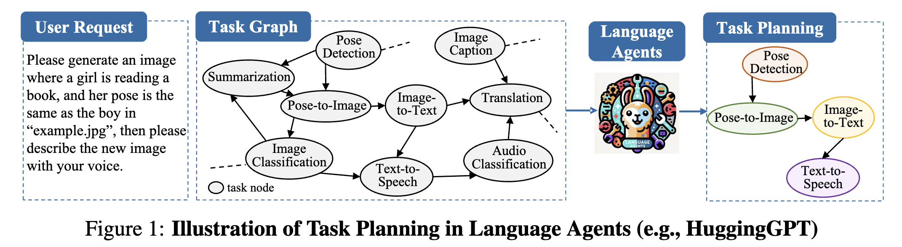

# GNN4TaskPlan: Implementation Study & Independent Analysis

This repository presents an implementation-focused study of **Can Graph Learning Improve Planning in LLM-based Agents?** (NeurIPS 2024), based on the authors' official codebase.

I traced the released implementation from task decomposition and graph construction through retrieval and evaluation, and added independent analysis tooling to examine the supplied prediction outputs.

> **Attribution and scope:** GNN4TaskPlan, its implementation, the datasets, and the reported results belong to the original authors. This repository does not claim authorship of the original research or implementation.

## The problem the paper tackles

LLM-based agents can decompose user requests into sequences of tool calls, but planning becomes more challenging when tool dependencies impose structural constraints. In such settings, the available tools can be represented as a graph, and valid tool selection depends not only on language understanding but also on these structural relationships.

The paper asks whether giving the planner that graph structure explicitly can help. Instead of relying only on the LLM generating a plan token by token, it mixes language-model representations with graph-aware retrieval of tasks.

## How it fits together
```text
User Request
     ↓
LLM Task Decomposition
     ↓
Task Steps / Candidate Tools
     ↓
Task Graph
     ↓
Language-Model Representations
     ↓
Graph-Aware Retrieval
     ↓
Predicted Task Nodes + Links
     ↓
Structural Evaluation

## System Overview



*Figure from the original GNN4TaskPlan implementation; included here for reference.*

```

## Implementation Scope

I traced the released implementation end to end, from task decomposition and graph construction to retrieval and evaluation, and documented the main design choices and implementation-level behavior.

**Training-free methods**

- **Direct**: the LLM plans the tasks directly.
- **GraphSearch**: searches the task graph using GreedySearch, AdaptiveSearch, and BeamSearch.
- **SGC**: a training-free approach that combines language-model embeddings with graph structure.

**Training-based methods**

- LM + GNN task retrieval
- GNN variants: SGC, GCN, GAT, GraphSAGE, GIN, and TransformerConv
- Positive and negative step–tool training pairs
- GNN-only and LM + GNN co-training

**Evaluation**

Generated plans are scored with Node-F1, Link-F1, plan accuracy (Node-F1 ≥ 0.99), and node and link hallucination rates.

My code-to-concept notes live in [`docs/IMPLEMENTATION_NOTES.md`](docs/IMPLEMENTATION_NOTES.md).

## Implementation-Level Observations

These all come from reading the released implementation.

### 1. Direct planning asks for structured output

The direct pipeline prompts the LLM for task steps, task nodes, arguments, and task links. There's also handling for malformed outputs, so inference keeps going even when the model returns something that isn't valid right away.

### 2. SGC spreads graph information through the tool embeddings

First, the language model produces embeddings for the available tools. Then the task graph is turned into a normalized adjacency matrix:
```text
A_norm = D^(-1/2) A D^(-1/2)

```

That matrix propagates information between connected tools, and the result gets blended with the original embeddings:
```text
H = αX + (1 − α) A_norm X

```

The training-free code tries several values of `α`, from `0.50` to `1.00`.

### 3. Retrieval goes step by step and stays on the graph

For the first step, the best-scoring tool can come from the whole tool set. After that, candidates are limited to the **outgoing neighbors of the tool picked just before**. If no neighbor works, that step is skipped.

So the quality of the task graph matters a lot here. A missing or wrong edge can directly hurt the plan.

### 4. Training uses positive and negative tool candidates

For each task step, the training code builds positive and negative tool candidates. The LM and GNN representations score them, and the model is optimized with a pairwise softplus ranking loss:
```text
L = mean(softplus(score_negative − score_positive))

```

### 5. Structural Constraint in the Training Data

The data preparation only keeps:

- single-tool examples, and
- multi-tool examples that form one chain.

Anything with a branching structure gets filtered out of this training path. That's worth remembering when you read the training-based results, since they say less about complex, branching plans than you might assume.

## The analysis tooling I added

I put a small analysis layer in [`analysis/`](analysis/). I didn't touch the original GNN4TaskPlan model code.

### `evaluate_provided_predictions.py`

This script scores the prediction files that already ship with the original repo. It only uses the Python standard library, and it reports:

- prediction-record coverage
- non-empty-step coverage
- Node-F1 and Link-F1
- plan accuracy
- node and link hallucination
- the lowest-scoring examples

I kept it separate from the original `evaluate.py` on purpose, so it's clear which evaluation came from where.

Run it from the repo root:
```powershell
python analysis/evaluate_provided_predictions.py --dataset huggingface --llm CodeLLaMA-13b --method direct

```

To save a machine-readable report:
```powershell
python analysis/evaluate_provided_predictions.py --dataset huggingface --llm CodeLLaMA-13b --method direct --save results/huggingface_codellama_direct.json

```

One thing to be clear about: the script evaluates **existing prediction files**. It doesn't run any new CodeLLaMA inference.

## The original evaluation pipeline

The authors' own evaluation runs like this:
```powershell
python evaluate.py --llm=CodeLlama-13b --dataset=huggingface --method=direct

```

It lines predictions up against the dataset's test split and computes Node-F1, Link-F1, plan accuracy, and the hallucination metrics.

## Results from the original paper

The following results were **reported by the original authors** and are included for reference; they are not presented as independently reproduced results.

### CodeLLaMA-13B, selected training-free results

| Dataset     | Direct Node-F1 (%) | Direct Link-F1 (%) | SGC Node-F1 (%) | SGC Link-F1 (%) | Direct Tokens (×10³) | SGC Tokens (×10³) |
| ----------- | ------------------ | ------------------ | --------------- | --------------- | -------------------- | ----------------- |
| HuggingFace | 57.55              | 28.88              | 65.51           | 39.44           | 2.45                 | 2.31              |
| Multimedia  | 68.57              | 41.79              | 73.32           | 53.28           | 2.59                 | 2.43              |
| Daily Life  | 91.20              | 76.07              | 92.96           | 79.57           | 3.88                 | 3.64              |
| TMDB        | 68.91              | 43.74              | 71.40           | 47.55           | 2.02                 | 1.90              |

### Evaluation example from the original repo

The authors' repository also includes this example:

| Dataset     | LLM           | Mode  | Node-F1 | Link-F1 | Accuracy | Node Hall. (Micro) | Node Hall. (Macro) | Link Hall. (Micro) | Link Hall. (Macro) |
| ----------- | ------------- | ----- | ------- | ------- | -------- | ------------------ | ------------------ | ------------------ | ------------------ |
| HuggingFace | CodeLLaMA-13B | chain | 0.5755  | 0.2888  | 0.1429   | 0.1656             | 0.4306             | 0.4228             | 0.6338             |

For the full set of results, see the [paper](https://arxiv.org/abs/2405.19119) and the [official repository](https://github.com/WxxShirley/GNN4TaskPlan).

## Repository structure
```text
.
├── analysis/                   # My lightweight analysis utilities
├── docs/                       # Implementation and research notes
├── results/                    # Analysis outputs generated locally
├── GraphToken/                 # Baseline implementation from the original repo
├── data/                       # Original datasets and preprocessing code
├── finetunellm/                # Original LLM fine-tuning/inference code
├── prediction/                 # Prediction files supplied by the original project
├── trainfree/                  # Direct, GraphSearch, and SGC implementations
├── traingnn/                   # Training-based GNN implementation
├── utils/                      # Data loading, graph construction, and retrieval utilities
├── evaluate.py                 # Original evaluation implementation
├── requirements.txt            # Original environment specification
├── trainfree_script.sh         # Original training-free experiment commands
└── traingnn_reproduce.sh       # Original GNN/LM+GNN experiment commands

```

## A note on evaluation coverage

By default, the original `evaluate.py` uses `remove_non_pred=1`. That means any test ID without a matching prediction record is dropped from the evaluation.

My evaluator reports two separate numbers:

- **prediction-record coverage**: how many test examples have a prediction at all
- **non-empty-step coverage**: how many of those predictions actually contain task steps

This way you can tell the difference between a prediction that's missing and one that's there but empty.

## Reproducibility notes

The upstream repo targets an older research environment, with pinned versions of NumPy, PyTorch, PyTorch Geometric, FastChat, vLLM, and a few other libraries. Some of the LLM inference and fine-tuning experiments also assume larger GPU setups.

Here's what I worked with:
```text
OS: Windows 11
CPU: Intel Core i7
GPU: NVIDIA GeForce RTX 3050 6GB
RAM: 16GB

```

That's why I'm **not** claiming a hardware-matched reproduction of the paper's full experiments.

## Limitations

- The core GNN4TaskPlan implementation comes from the original authors.
- I haven't rerun the full paper-scale benchmarks on my machine.
- The reference tables are author-reported numbers.
- My analysis works on the prediction files shipped with the original repo. It doesn't produce new model predictions.
- The training-data preparation favors chain-structured plans, so it doesn't fully cover branching task graphs.
- Graph-constrained retrieval is only as good as the task graph underneath it.

## Research Questions Motivated by the Implementation

Going through the code left me wondering about a few things:

1. How much does the result depend on the balance between graph information and language representations?
2. How well does step-by-step, graph-constrained retrieval hold up when edges are noisy or missing?
3. How does performance change as the graph gets deeper or more branching?
4. Could graph reasoning kick in only when the base LLM is unsure about the next tool?

These are open research questions motivated by the implementation; they are not validated findings from this repository.

## Attribution

This repository builds on the official implementation of:

**Can Graph Learning Improve Planning in LLM-based Agents?**

**Authors:** Xixi Wu, Yifei Shen, Caihua Shan, Kaitao Song, Siwei Wang, Bohang Zhang, Jiarui Feng, Hong Cheng, Wei Chen, Yun Xiong, Dongsheng Li

**Venue:** NeurIPS 2024

**Official repository:** [https://github.com/WxxShirley/GNN4TaskPlan](https://github.com/WxxShirley/GNN4TaskPlan)

**Paper:** [https://arxiv.org/abs/2405.19119](https://arxiv.org/abs/2405.19119)

All credit for the research goes to the original authors. Their MIT license and copyright notice are kept in [`LICENSE`](LICENSE).

## Citation

If you use or discuss the original research, please cite:
```bibtex
@inproceedings{wu2024graph,
  title={Can Graph Learning Improve Planning in LLM-based Agents?},
  author={Wu, Xixi and Shen, Yifei and Shan, Caihua and Song, Kaitao and Wang, Siwei and Zhang, Bohang and Feng, Jiarui and Cheng, Hong and Chen, Wei and Xiong, Yun and Li, Dongsheng},
  booktitle={Proceedings of Neural Information Processing Systems},
  year={2024}
}


```
